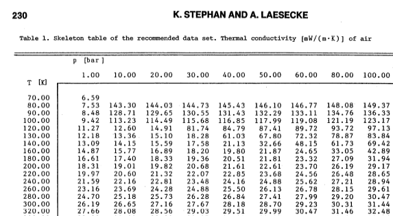

```{r setup, include=FALSE}
knitr::opts_chunk$set(echo = TRUE)
library(printr)
library(ggplot2)
library(reshape2)
```

Find least-squares fit of thermal conductivity to air temperatures.
Table from Stephan and Laesecke (1985):\
 

Read in .csv file of values for 1 Bar.
```{r read values}
tablevals <- read.csv("Lambda_vs_tk.csv", header = TRUE, 
                      stringsAsFactors = FALSE)
tablevals

```

convert units of conductivity to W/mK from mW/mK  
```{r}
tablevals$Lambda <- tablevals$Lambda / 1000
tablevals
```


## Do linear regression of thermal conductivity vs air temperature (K)

```{r}
fit <- lm(Lambda~TK, tablevals)
```

Regression coefficients and statistics
```{r results = "asis"}
summary(fit)
```

Calculate CRHM values divided by 10
```{r}
tablevals$CRHM_divided_by_10 <- (tablevals$TK * 0.00063 + 0.0673) / 10
```
Plot original table data (black points), least-squares fitted line and CRHM values 
divided by 10 (red points)

```{r do plot}
ggplot(tablevals, aes(TK, Lambda)) + geom_point(colour = "black") +
  geom_smooth(method = "lm") + xlab("Air temperature (K)") +
  ylab("Thermal conductivity of air (W/mK)") +
  geom_point(aes(TK, CRHM_divided_by_10), colour = "red")

```

## Do regression of table values against air temperature in degrees Celsius
```{r Tc}
tablevals$TC <- tablevals$TK - 273.15
fit2 <- lm(Lambda~TC, tablevals)

```
Regression coefficients and statistics
```{r results = "asis"}
summary(fit2)
```
```{r do second plot}
ggplot(tablevals, aes(TC, Lambda)) + geom_point(colour = "black") +
  geom_smooth(method = "lm") + xlab("Air temperature (°C)") +
  ylab("Thermal conductivity of air (W/mK)") 

```


## Use method of Tsilingiris(2007)

```{r Tsilingiris}

KA0 <- -2.276501e-03
KA1 <- 1.2598485e-04
KA2 <- -1.4815235e-07
KA3 <- 1.73550646e-10
KA4 <- -1.066657e-13
KA5 <- 2.47663035e-17

tablevals$Tsilingiris <- KA0 + KA1 * tablevals$TK + KA2 * tablevals$TK^2 +
  KA3 * tablevals$TK^3 + KA4 * tablevals$TK^4 + KA5 * tablevals$TK^5
tablevals <- tablevals[,c("TK", "Lambda", "CRHM_divided_by_10", "Tsilingiris")]
tablevals

```


Plot original tables values and Tsilingiris.
The line is the linear model fitted above.
```{r do third plot}

melted <- melt(tablevals, id.vars = "TK")
ggplot(melted, aes(TK, value, colour = variable)) + geom_point() +
  xlab("Air temperature (K)") +
  ylab("Thermal conductivity of air (W/mK)") +
  geom_abline(slope=coefficients(fit)[[2]], intercept = coefficients(fit)[[1]])
```


So, we can use the linear regression equations, for air temperatures in K or °C with results
that are at least as good as the Tsilingiris fifth-order polynomial.
