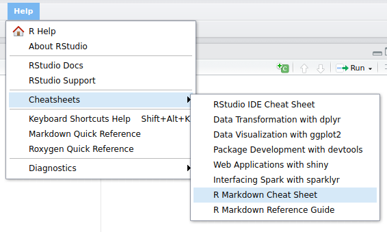
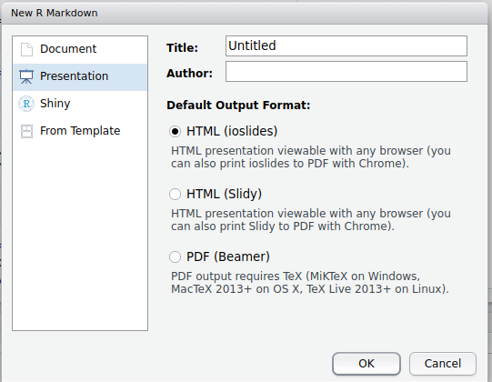

Creating documents in R
========================================================
author: Kevin Shook
date: January 24, 2018


Why create documents in R?
========================================================
- Makes research reproducible
  - combines code with output
  - allows detailed explanation of the code
- Makes your research document more reproducible
  - will always contain up-to-date values
- Allows you to distribute you results to others


R documents
========================================================
- Can include
  - text
  - live R code
    - output from code
  - figures
  - images
  - equations


R document types
========================================================
- Reports
- Research notebooks
- Slides
- Documentation
- Books
- Web apps


Output formats
========================================================
- html
- pdf
- Word

Creating R documents
========================================================
- Write plain text using Markdown
  - text markup language
  - simpler than LaTex (can also use LaTex)
- Install package **rmarkdown**
- Needs to have several packages installed
  - slow, but only needs to be done once  
  
***
- Need LaTex installed if you use equations
- Install Pandoc to convert output formats
http://pandoc.org

Markdown
========================================================
- All documents, regardless of type or output format use same formatting
- R studio has built-in cheatsheets
- Command is **Help|Cheatsheets**

***



Markdown formatting
========================================================


Text
========================================================
- All text is in paragraphs, even if you manually break the line
- To force a line break, put 2 spaces at the end of a line

This is an example  
of how to break text

Emphasis
========================================================
- put asterisks or underscores before and after text to emphasize it
 - * italics * -> *italics*
 - ** bold ** -> **bold** 


Titles
========================================================
- Titles indicated using leading ```#``` symbols

`# Header 1
# Header 1
`## Header 2
## Header 2
***
`### Header 3 
### Header 3 

Bullets
========================================================
- Each bullet is prefixed by a hyphen
  - indent using tab or 2 spaces
  
Images
========================================================
- Use command  
`!`[`optional text`]`(`filename`)`


Inline R code
=======================================================
- Put code between back ticks following "r": `` ` ``r `` ` ```

Example:

There were `` ` `` r nrow(cars)`` ` `` cars studied
 
Will produce:

There were 50 cars studied

R code chunks
=======================================================
- R code can be placed in chunks of multiple lines
- Each chunk can be executed separately
- Insert a new chunk by pressing **[Ctrl][Alt][i]**


Running a chunk
=======================================================
- Click on the green triangle to run
- Click on the gear to set options
<div align="left">

</div>


```
1 2 3 4 5 6 7 8 9 10
```

LaTex
======================================================
- Equations can be added by enclosing them with $ 
- Use ``$$`` to centre equation on the line

`` $$\frac{\alpha}{\beta} = \gamma$$ ``

$$\frac{\alpha}{\beta} = \gamma$$


Tables
=====================================================
- Create a table using pipes (|) and hyphens  
``header1|header2``  
``-------|-------``  
``row1|row1``  
``row2|row2``  

header1|header2
-------|-------
row1|row1
row2|row2

Formatting R output
=====================================================
- Many R commands produce tables of output
  - work well for monospaced text
  - not optimised for proportionally-spaced text

```r
head(mtcars)
```

```
                   mpg cyl disp  hp drat    wt  qsec vs am gear carb
Mazda RX4         21.0   6  160 110 3.90 2.620 16.46  0  1    4    4
Mazda RX4 Wag     21.0   6  160 110 3.90 2.875 17.02  0  1    4    4
Datsun 710        22.8   4  108  93 3.85 2.320 18.61  1  1    4    1
Hornet 4 Drive    21.4   6  258 110 3.08 3.215 19.44  1  0    3    1
Hornet Sportabout 18.7   8  360 175 3.15 3.440 17.02  0  0    3    2
Valiant           18.1   6  225 105 2.76 3.460 20.22  1  0    3    1
```

Using other packages
====================================================
- Package **printr** automatically tidies tables

```r
library(printr)
head(mtcars)
```


|                  |  mpg| cyl| disp|  hp| drat|    wt|  qsec| vs| am| gear| carb|
|:-----------------|----:|---:|----:|---:|----:|-----:|-----:|--:|--:|----:|----:|
|Mazda RX4         | 21.0|   6|  160| 110| 3.90| 2.620| 16.46|  0|  1|    4|    4|
|Mazda RX4 Wag     | 21.0|   6|  160| 110| 3.90| 2.875| 17.02|  0|  1|    4|    4|
|Datsun 710        | 22.8|   4|  108|  93| 3.85| 2.320| 18.61|  1|  1|    4|    1|
|Hornet 4 Drive    | 21.4|   6|  258| 110| 3.08| 3.215| 19.44|  1|  0|    3|    1|
|Hornet Sportabout | 18.7|   8|  360| 175| 3.15| 3.440| 17.02|  0|  0|    3|    2|
|Valiant           | 18.1|   6|  225| 105| 2.76| 3.460| 20.22|  1|  0|    3|    1|

Types of documents
====================================================


Notebooks
====================================================
- Creates a notebook of R code, using chunks
- use **File|New File|Notebook**
- Creates a skeleton document 
- Default output is html, can be changed

Example notebook
====================================================
- Small piece of R work
- Combines text, an image, R code, output (including figures)
- Output table is formatted

Notebook parameters
====================================================
- Parameters can be passed to notebooks
- Useful for creating custom reports
- See http://rmarkdown.rstudio.com/developer_parameterized_reports.html?version=1.1.414&mode=desktop

Slides
====================================================
- You can create 2 types of presentations:
1. **.Rpres** presentations
2. **.Rmd** presentations

.Rpres presentations
====================================================
- This presentation is an example
- Stored in file with extension .Rpres
- Requires RStudio to view
- To create a presentation, use **File|New File|R Presentation**
- Each slide has a title line with at least 3 equals signs underneath:  

Slide title  
`====================================================

.Rmd presentations
====================================================
- Can produce more sophisticated slides
- Requires LaTex
- To create a presentation, use **File|New File|R Markdown**

***



Documentation
====================================================
- Each R function in a package needs to be documented
- R package documentation can include **vignettes**
  - long form documentation, written in Markdown
- A great way to contribute to an R package
  - a great way to learn about R packages
- Command is **File|New File|R Markdown...**
  - select **From Template**, then **Package Vignette (HTML)**
  
Books
=====================================================
- The manual for ggplot2 is written in Markdown.
- You can download it and build the document
https://github.com/hadley/ggplot2-book
- Uses lots of add-in packages, and there can be issues with their versions
- I have already built the book, you can download the file **ggplot-book.pdf** from the github repository for this seminar

Bookdown
=====================================================
- Can create books (printed or eBooks) in R
- Get package **bookdown**
- Books can be in  PDF, LaTeX, HTML, EPUB, or Word
- E books can also be published to web: https://bookdown.org

Thesis
=====================================================
- It is possible to write a thesis in R!
- A package **thesisdown** was created by Reed College
- Requires **bookdown**
https://github.com/ismayc/thesisdown


Shiny
======================================================
- For building websites powered by R
- Install package **shiny** normally
  - See website https://shiny.rstudio.com/ for more info
- Code can run on your own computer, or on a cloud server (free for up to 5 apps, $ for more) or a local server
- Shiny app has 2 parts:
  - ui - creates the user interface
  - server - runs on the server

Summary
======================================================
- You *can* create a wide variety of documents in **R**
- Whether or not you *should* depends on your use
  - also depends on what the final purpose of your document will be, and who will be using it
